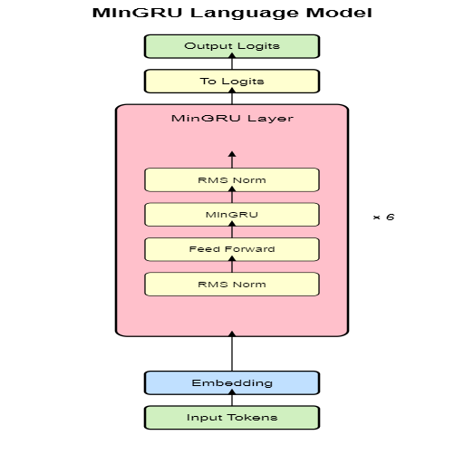
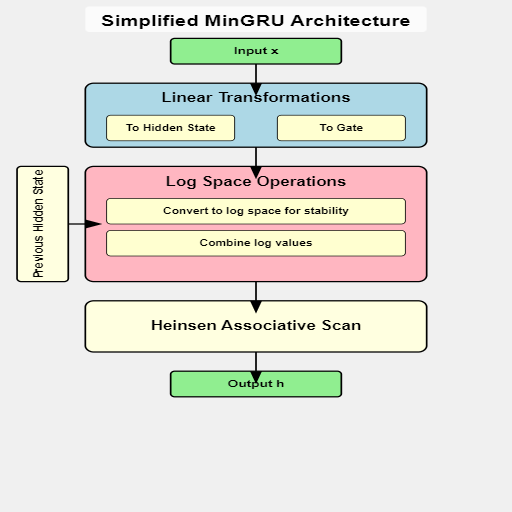
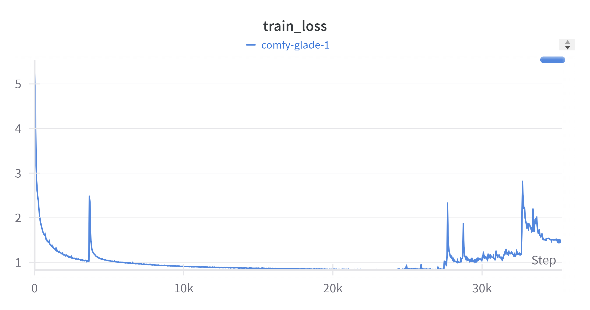
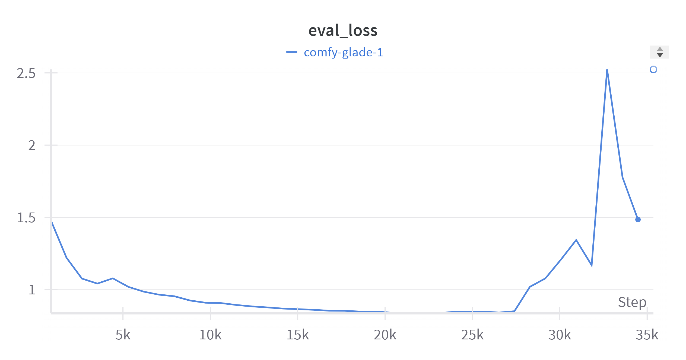
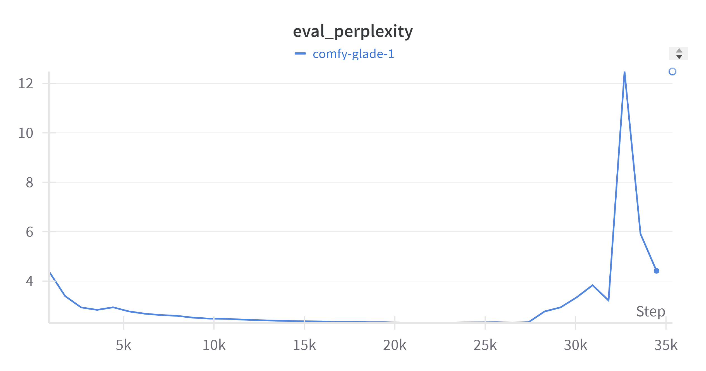

# MinGRU

A MinGRU model with 17,323,008 million parameters.


Mingru-lm             |  Mingru
:-------------------------:|:-------------------------:
 | 


The MinGRU model is a simplified version of the traditional Gated Recurrent Unit (GRU), designed to reduce complexity and improve efficiency. By removing the hidden state dependencies from its gates, MinGRU allows for parallel training, which is much faster compared to traditional GRUs. Additionally, it eliminates the use of non-linear activations like tanh, further streamlining computations.

| Parameters           | Value | Description                                       |
|----------------------|-------|---------------------------------------------------|
| `--dim`              | 512   | Dimension for the model                           |
| `--num_tokens`       | 256   | Maximum tokens for model (max is 256 due to ASCII)|
| `--num_layers`       | 6     | Number of layers to train the model               |


# Examples 

Here is an examples generated by the model after training it 
```python
once upon a time, there was a little girl named Lily. She loved to play outside and explore the world around her. One day, she decided to make a cool. Lily wanted to mxing, she saw something on the ground and got stuck in a hole. When she was many corner of the girl with her parents and her tears were fboard for her to be cution of the stairs. She gave her mom, she felt a little boy was, so she started to feel safe.Onstally, Lily went to a visit her could go in her backyard. She said to investigate and Lily
```

### Try the Pre-trained Model
You can try the pre-trained model in this Hugging Face Space app:
[MinGru](https://huggingface.co/spaces/damerajee/mingru-stories)  

# Training Details

The model was trained using two NVIDIA T4 GPUs in a distributed data parallel (DDP) setup, which significantly sped up the training process. We utilized PyTorch’s DistributedDataParallel (DDP) to ensure that the model’s parameters were synchronized across both GPUs during training.

| Hyperparameter        | Type   | Default Value | Description                                       |
|-----------------------|--------|---------------|---------------------------------------------------|
| `--batch_size`        | int    | 204           | Batch size for training                           |
| `--lr`                | float  | 4e-3          | Learning rate for training the model              |
| `--wd`                | float  | 1e-2          | Weight decay for your optimizer                   |
| `--epochs`            | int    | 40            | Total number of epochs                            |


# Dataset Information 

Trained the model on the  [tiny-stories](https://huggingface.co/datasets/roneneldan/TinyStories?row=19]) dataset 

# Getting started 

Before we begin the model was trained on two t4 kaggle gpus so the file train_ddp.py will work there but you can still train the model using the train.py 

- First git clone this repo 
```bash 
git clone https://github.com/dame-cell/MinGru.git
cd MinGru 
pip install -r requirements.txt 
cd mingru 
```

- First you will need to prepare the dataset just simply run this code,it will take less than 1 min or maybe  

```bash
python data.py 
```


- Then train the model 
```bash 
python train.py --path_to_train_data (required) --path_to_test_data (required) --batch_size 204 
```

# Plots and observations 

The train loss seems went down but at the end it start rising at the last steps , a few reasons could be: 

- The model started overfitting 
- Maybe I need to add more  regularization 

<p align="center">
  
</p>

<p align="center">
  
</p>

<p align="center">
  
</p>

# Citations

```bibtex
@inproceedings{Feng2024WereRA,
    title   = {Were RNNs All We Needed?},
    author  = {Leo Feng and Frederick Tung and Mohamed Osama Ahmed and Yoshua Bengio and Hossein Hajimirsadegh},
    year    = {2024},
    url     = {https://api.semanticscholar.org/CorpusID:273025630}
}
```

# Acknowledgement 

Thank to [lucidrains](https://github.com/lucidrains/minGRU-pytorch/blob/main/README.md?plain=1) for the reference code 